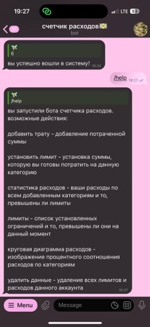
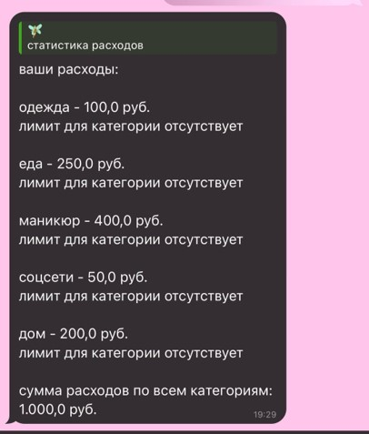
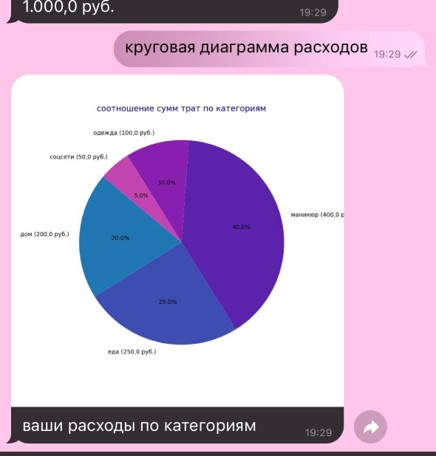

# Spending Control Bot — Telegram бот для контроля расходов 

**Spending Control Bot** — это асинхронный Telegram-бот, который помогает пользователям отслеживать свои траты, устанавливать лимиты по категориям и анализировать расходы с помощью наглядной статистики.

## Цель проекта

Помочь людям контролировать личные финансы: понимать, на что уходят деньги, и планировать бюджет. Бот подходит как для индивидуального использования, так и для ведения семейного бюджета (несколько пользователей могут вести общий учёт).

## Возможности

- Регистрация и вход по логину и паролю. Данные привязаны не к user_id Telegram, а к логину. Это позволяет вести бюджет с нескольких аккаунтов (например, семейный) или использовать один аккаунт для разных бюджетов (личный, рабочий).
- Запись расходов по категориям с автоматическим сохранением в базу данных.
- Установка лимитов на категории трат.
- Вывод статистики расходов в виде круговых диаграмм.
- Проверка любого некорректного ввода от пользователя — бот обрабатывает ошибки и подсказывает правильные действия.
- Интуитивно понятный интерфейс: у каждой функции понятное назначение, есть встроенная помощь.

## Технологии и подходы

- Язык программирования: Python
- Асинхронность (для быстрой и стабильной работы)
- База данных: SQLite3 (таблицы пользователей, расходов и лимитов)
- Библиотеки: Pandas (для построения диаграмм), aiogram 

## Качество кода

Код написан с соблюдением следующих принципов:
- Читабельность и понятная структура
- Наличие комментариев к ключевым блокам
- Соответствие стандарту PEP8
- Явная типизация (type hints)

## Структура базы данных

- Таблица пользователей (хранит логины и пароли зарегистрированных пользователей)
- Таблица расходов (хранит траты пользователя по категориям)
- Таблица лимитов (хранит установленные пользователем ограничения по категориям)

## Демонстрация работы

### Команда /start
При запуске бот отправляет приветственное сообщение:


### Вход в систему
Войти в систему можно по логину и паролю, в одном аккаунте может находиться много человек сразу:


### Команда помощи


### Вывод статистики расходов


### Вывод диаграммы на основе статистики



## Установка и запуск

### 1. Получение токен у BotFather 

1. Откройте Telegram и найдите бота **@BotFather**.
2. Отправьте команду `/newbot`.
3. Придумайте имя для бота 
4. Придумайте username для бота
5. После создания BotFather отправит вам токен.

### 2. Клонирование репозитория

```bash
git clone https://github.com/dinnksis/spending-control-bot.git
cd spending-control-bot
```

### 3. Вставьте токен в config.py


### 4.Запуск
```bash
# виртуальное окружение
python -m venv venv

# Windows
venv\Scripts\activate
# macOS / Linux
source venv/bin/activate

#установка зависимостей
pip install requirements.txt

#запуск бота
python main.py
```

### 5. Бот активен по username 


